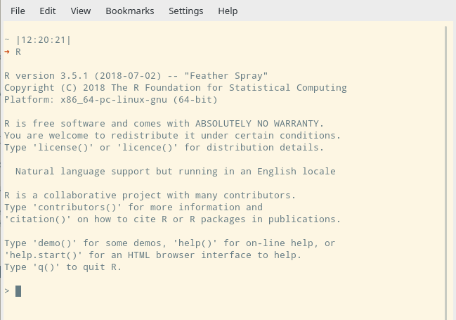

```{r setup, include=FALSE}
knitr::opts_chunk$set(echo = TRUE)
```

This document is intended to provide a quick (yet complete!) overview of the 
`R` language, so you can get started with it as soon as possible. No 
chit-chatting, just the basics, code and comments! Oh well, we will give some details 
concerning the first steps; and sometimes we will link to useful
resources, just in case you really want to go deeper into some topic ...

# Getting `R`
## Why `R`?
Really? I though you were impatient! In short, `R` is is a programming language 
focused on statistical computing and graphics. And it is available as Free Software!
If you really want to read more, see [What is R?](https://www.r-project.org/about.html)
or just Google about it.

## Installing `R` and `RStudio`
Want to install `R`? Google "install R" followed by your operating system. There
are thousands of great Howtos much better than I could ever write.

`RStudio` is an IDE that makes R easier to use. It includes a code editor, 
debugging & visualization tools. You may not install it (or install other 
IDE), but a highly recommend it. Go to the 
[RStudio download page](https://www.rstudio.com/products/rstudio/download/#download)
and find the installer for your operating system. The installation should be 
straightforward. If not, (you guessed it) Google it!

## Our first session
### The `R` interpreter
OK, we have installed `R`. It is time to get started! Actually, one last thing
before we get started. It is important to note that `R` is an 
[interpreted language](https://en.wikipedia.org/wiki/Interpreted_language) which
means that all commands/code you write is executed immediately. This means
that `R` can work interactively, using a question-and-answer model. Let's actually
try this! Forget about `RStudio` and start and `R` terminal ...

* ... by double-clicking on some `R` desktop icon.
* ... if you are on Linux or Mac, by opening a system-terminal and entering `R`.

You should see something like this:

<div style="text-align:center"></div>\
<!--  -->

Nice! Let's enter some commands and quit!

<div style="text-align:center"></div>\

What is that workspace thing about? `R` has the ability to save objects, to load
them again later. Whenever exiting, `R` asks you if you want to save all the 
variables. If your answer is yes, it will restore them when starting the next
time.

### The `RStudio` environment
It's good to know that the `R` console exists, but let's move to `RStudio` to
make our lives easier. The `RStudio` essentials are summarized in the following
figure:

<div style="text-align:center"></div>\ 

Although the best way to learn it is just using it I would recommend to 
to spend a few minutes looking around. Specially, have a look to `
tools > global options`. Also, you may find helpful this
[webinar series](https://www.rstudio.com/resources/webinars/rstudio-essentials-webinar-series-part-1/). 

# An overgrown calculator
The "Hello world" of an interactive language is using it as a calculator. Enter
the following chunk of code in the R console (output not shown). It's easy 
enough, but careful! Read the comments!

```{r calculator, results='hide'}
1 + 2
1         +         2    # Spaces don't matter
1 +                      # Incomplete commands can occupy several lines. In the console,
  2                      # the usual letter > is replaced by + to indicate an incomplete command.
(3 + 2 * 2 ) / 4         # Usual operations
2 ^ 3; 5 %% 2; 5 %/% 2   # Separate commands with ; => exponents; modulo; integer division
exp(0); cos(pi); sin(0)  # There are also common math-functions here

# There are also some special values 
1 / 0                    # Infinite values
0 / 0                    # NaN values: Not a Number
NA                       # Not Available. May be useful for missing data. We will come 
                         # back to this later
```

As in any programming language, `R` has **variables**. A variable allows you to 
store a value for using it later, which is helpful if you need to reuse a 
value through your code. In `R` you assign values with `<-` or `=`. There are
some minor differences that we can ignore. If you are interested, see 
[this](https://www.r-bloggers.com/assignment-operators-in-r-%E2%80%98%E2%80%99-vs-%E2%80%98-%E2%80%99/), although first read this document. There is debate about which one is 
preferable. Most part of the `R` community recommends `<-` and I will stick with
that (although I must admit that I prefer `=`). Do whatever you want, but be 
consistent with your choice.

```{r variables, eval=FALSE}
x <- 3           # We can assign with <-  or =. 
y =  4           
x <- log(x + y)  # You can reassign variables
print(x)
```

Wow! That `log` function seems interesting. But what if you can't remember 
what a `log` is? Use the **`R` built-in help**:

```{r help, eval=FALSE}
?log             # or help(log)
# If you can't remember the exact function name, use ?? to search for concepts
??logarithm
```

After typing `?log` something similar to the following figure should appear:

<div style="text-align:center"></div>\ 

Most `R` functions are well-documented. If you feel overwhelmed by the 
documentation, have at least a read to:

* Arguments.
* Value (what the function returns).
* Examples.

The argument section of `log` says that the function takes two arguments
separated by a comma.  However, the second is optional since `R` provides it
with a default value `base = exp(1)`:

```{r values, results='hide'}
log(2); log(2, base = exp(1));   # These are equivalent calls
log(2, base = 2)                 # Now use base 2 ...
log2(2)                          # ... although this is easier  
log(2, 2)                        # We can also use unnamed arguments ...
log(base = exp(1), 2)            # ... but the good thing about named-arguments
                                 # ... is that we don't have to remember the proper order
log(2, bas = 2)                  # If there isn't ambiguity, partial names are fine
```

Another thing you may have noticed from the `log` help is that the input should
be \<\<a numeric or complex vector\>\>. Indeed, all numbers in `R` are treated 
like **vectors** and most functions are **vectorized**. More about this in a 
while. First, let's create some vectors.

```{r vectorized}
# Vector creation:
## The following three are equivalent: 
a = c(1, 2, 3, 4, 5)          # Create a vector with c (c from concatenate)
b = 1:5                       # 1:5 generates sequence of numbers from 1 to 5...
d = seq(1, 5)                 # ... which is equivalent to seq(1, 5)

## This 4 are not equivalent, but are useful ;)
e = c()                       # An empty vector
f = seq(1, 5, by = 2)         # Move in steps of 2 to generate c(1, 3, 5) ...
g = seq(1, 5, length.out = 2) # or ask for a length and let R calculate the step size
h = rep(3, 5)                 # repeat three five times

# We can concatenate vectors to create larger ones
c(e, f)                       # empty vector + f
c(g, h)

# Random vectors
j = runif(3)                  # you can also generate random vectors from uniform ...
k = rnorm(3)                  # ... or Gaussian distributions.

# We can have a vector with some missing observations
l = c(1, 2, NA, 4)

# We can find the length of each vector with length
cat("A has length", length(a), "\n")
```

What about the *vectorized function* thing? In a nutshell, a function `f` is 
vectorized if: 

<center>
vector-in `c(x1, x2, ...)` $\rightarrow$ vector-out `c(f(x1), f(x2), ...)`.
</center>

Or in another way, the same transformation is applied element-wise to the input.

```{r vectorized_2}
# A vectorized function 
log(1:5)
# A horrible way of obtaining the same result is:
c(log(1), log(2), log(3), log(4), log(5))
# An important note about vectorization: when two vectors are not of equal 
# length, the shorter one is recycled
1:10 + c(0, 2)                 
# Recycling permits multiplying/adding/subtracting/... vectors by scalars 
2 * 1:3        # even numbers
```

Not all functions are vectorized. For example, some functions accept a vector
as argument but, instead of returning another vector, they collapse the vector 
in a single number:

```{r}
x <- 1:4
print(c(mean(x), min(x), max(x), sum(x), prod(x)))

# The results change if we add a NA to the vector ...
x <- c(x, NA)
print(c(mean(x), min(x), max(x), sum(x), prod(x)))

# ... but this can be easily solved removing the NAs (na.rm)
print(c(mean(x, na.rm = TRUE), min(x, na.rm = TRUE), 
        max(x, na.rm = TRUE), sum(x, na.rm = TRUE), 
        prod(x, na.rm = TRUE)))
```

Other functions just return another vector that cannot be computed using an 
element-wise transformation:

```{r}
x <- c(2, 4, 6, 8)
diff(x)               # differentiate
cumsum(x)             # cumulative sum
range(x)              # c(min(x), max(x))
```

Finally, a very cool feature of this *overgrown calculator* is that it supports 
**plotting** (More about plotting later). 

```{r plotting}
# This is an illustrative example. Let's plot a 
# couple of functions
x <- seq(-2, 2, by = 0.2)
plot(x, exp(x), xlab = "x", ylab = "exp(1)", main = "My first plot", type = "o")
# Use lines to add another plot to the same graphic
lines(x, exp(0.5 * x), type = "o", col = 2, pch = 2, lty = 2)     
# A legend is always nice
legend("topleft", lty = 1:2, pch = 1:2, col = 1:2, 
       legend = c("exp(x)", "exp(0.5 * x)"))
```

Nice! Although maybe too many options? A recap of the strangest ones:

* `pch`: plotting character (circles vs triangles). Use numbers.
* `col`: color. You can use numbers or names ("red", "blue", etc.).
* `lty`: line type (solid vs dashed). Use numbers.
*  `type`: type of plot. For example, `"p"` for points, `"l"` for lines or 
`"o"` for both points and lines.

## Working with files
Alright! We are now ready to write some cool mathematical programs. Of course, 
we will like to keep our program safe by writing it into a file. This file 
should have  an *.R* extension. There are several ways of executing the program:

* In any `R` console: use `source("path_to_my_script.R")`.
* In `RStudio`: look for the `Source` button and click it. Tip: learn the keyboard
shortcut.
* In `RStudio`: Execute the code line by line with `Alt + Enter`. This is a nice
way of debugging easy programs.
* from a system terminal (e.g. Linux terminal): use `Rscript name_script.R` in
your system terminal.

From now on, I would recommend to work on the `RStudio` editor to don't lose
work.

# Beyond numbers: data types
Maths are cool, but we surely want to deal with something else than numbers. 
In this section we briefly review the main data types. For a more detailed 
exposition, see this [Datacamp free course](https://www.datacamp.com/courses/free-introduction-to-r).

## What is a data type?
This is one of those concepts that are better explained with an example. In 
`R`, some of the basic data types are:
```{r}
x = 4.5                          # We have decimal values, called "numerics"
y = 4                            # Integers, which are actually treated as "numerics"
w = TRUE                         # "logical" values. Change it to be FALSE
z = "This text is stupid"        # "character" values.
```

```{r}
# You can check the data type using the class function:
my_classes = c(class(x), class(w), class(z))
print(my_classes)        
```
```{r, results='hide'}
# Because of the vectorization thing, this is also "numeric"
print(class(c(1, 2, 3)))
# ... and this is "logical" too
print(class(c(TRUE, FALSE)))
# ... and this is "character" (check them!)
print(class(my_classes))
```

Data types are important because some operations are not permitted for certain
types:

```{r, eval=FALSE}
3 + "six"           # Error : non-numeric argument to binary operator
"two" + "three"     # Error : non-numeric argument to binary operator
```

Indeed, we cannot create vectors with mixed data types. The variables are 
**casted** (automatically converted, if possible) to the most "generic" type to 
allow the concatenation:

```{r}
c(1, TRUE, FALSE)        # TRUE and FALSE are casted to "numeric"
c(1, "two", FALSE)       # 1 and FALSE are casted to "character"
```

You can also explicitly convert values (if it makes sense):

```{r, results='hide'}
as.character(c(7, 1))     # "7" "1"
as.logical(c(1,0,1))      # TRUE FALSE TRUE
# This would fail: as.numeric("Hello")  
```


Although data types are important, `R` is a **dynamically typed** language, which 
means that we can assign anything to a  variable, not matter its past values:

```{r, eval=FALSE}
x = 4.5         # x is a "numeric" ...
x = TRUE        # ... now it is not!
```

We already have some experience with "numerics",
let's quickly introduce the  "logical" and "character" data types before moving on
to more complex types. Also, we shall review some of the special values that `R`
has.

### Logicals

```{r logicals}
# Logical typically appear when asserting logical statements. This statements may
# involve numerical data... 
c(3 == 3, 3 != 4, 5 > 3, 5 >= 3, 5 < 3, 5 <= 3)
# ... characters ... 
c("ABC" == "abc", "A" %in% c("A", "B", "C"))
# ... or even logicals
c(TRUE == TRUE, TRUE == FALSE, FALSE != FALSE, FALSE != TRUE)

# Missing data (NA) is logical, too
class(NA) 

# But it is casted when included in a vector, if necessary
class(c(1, NA))

# Use | and & for OR and AND operations
c(TRUE, TRUE, FALSE,FALSE) | c(TRUE, FALSE, TRUE, FALSE) 
c(TRUE, TRUE, FALSE,FALSE) & c(TRUE, FALSE, TRUE, FALSE) 

# There also exist || and && which only use the first element. This is important
# when using logicals inside control statements (if, while, ... see later)
c(TRUE, TRUE, FALSE,FALSE) || c(TRUE, FALSE, TRUE, FALSE) 
c(TRUE, TRUE, FALSE,FALSE) && c(TRUE, FALSE, TRUE, FALSE) 

# all and any are useful when dealing with a vector of logicals
c(all(c(TRUE, TRUE, TRUE, TRUE)),  all(c(TRUE, TRUE, TRUE, FALSE)))
c(any(c(TRUE, TRUE, FALSE,FALSE)), any(c(FALSE, FALSE, FALSE,FALSE)))
```

#### characters

```{r characters}
beautiful = "E = mc^2" 
class(beautiful)                          # "character"
# there is no difference between ' and "
beautiful == 'E = mc^2'                   # yields TRUE

# To paste in a single character we use paste or paste0: 
paste("Albert says", beautiful, sep = ": ")
# We can also count sheeps easily...
paste(2:4, "sheeps")
# Or reduce a vector into a single character
paste(1:4, collapse = ", ")
```

#### Special values
`R` has several special values. We have already discussed some of them, but it
is useful to list all of them together.

* `NA`: a "missing value".
* `NaN`: not a Number’,  e.g., `0 / 0`.
* `Inf`: and `-Inf`: infinite values, e.g. 1 / 0. 
* `NULL`: a Null object, which is sometimes used for programming convenience. 
For example `?plot.default` shows that some default argument values are `NULL` 
(see `xlim`). This is useful because, if the user does not provide a value, 
`plot.default` will infer on runtime a proper value from the input data. 

These are the basics of data types. Not bad! but `R` has much more to offer.


## Vectors (again)
Vectors are the basic data types in `R`. Indeed, numeric, character and 
logical are the three flavors of the vectors in `R`. Let's overview some 
common operations for vector:

```{r vectors}
set.seed(10)
# Imagine the following class... It seems that Hans didn't take the exam, so its
# grade is a NA.
students <- c("John", "Albert", "Maria", "Lisa", "Hans")
grades <- c(sample(1:10, 4, replace = TRUE), NA) # generate four grades randomly + a NA
age <- sample(20:30, 5, replace = TRUE)         # generate some random ages

# Indexing. Indexing in R starts at 1!
cat(students[1], ":", grades[1], "\n")
cat(students[2:3], " got grades ", grades[2:3], "\n")
cat(students[c(4, 5)], " got grades ", grades[c(4, 5)], "\n")
# We can also assign names to a vector to index by that name
names(grades) <- students
print(grades["Lisa"])

# There exist the variant [[]], which can be used with a single index/name. 
# When used, the name is dropped. Compare with the previous result:
print(grades[["Lisa"]])

# It is also possible to use negative numbers: negative numbers drop the indicated
# indices from the list
students[-1]               #  All elements but the first
students[-(1:2)]           #  All elements but the two first ones

# These are handy too
head(grades, 3)             # The first three values
head(grades, -3)            # All but the last three values
tail(grades, 3)             # The last thee values
tail(grades, -3)            # All but the last three values
```

Logical conditions can also be used for indexing:

```{r logical indexing}
which(grades < 5)                 # Find the indices of those who haven't pass 
print(age[which(grades < 5)])     # We can use this index to find his age

grades < 5                        # We can also use this... 
print(age[grades < 5])            # but NAs will appear!


# We can easily find the mean age of those who have passed, taking care of 
# eliminating the NAs (Note the use of &). There are similar functions to check
# if values are infinite (is.infinite) or NaN (is.nan).
cat("The mean age is: ", mean(age[grades > 5 & !is.na(grades)]), "\n")

# The %in% function is also useful. Let's check if Maria and Hans took the exam...
"Maria" %in% names(grades[!is.na(grades)])
"Hans" %in% names(grades[!is.na(grades)])
```


## Matrices
Matrices are a generalization of vectors to 2D. Just like with `R` vectors, they
only admit a **single base data type**.

```{r basic_matrices, results='hide'}
set.seed(100)
# Compare the ordering of both matrices:
matrix(1:9, nrow = 3)
matrix(1:9, byrow = TRUE, nrow = 3)

# We can also create matrices of booleans or characters, but we can't mix
# data types (they are coerced)
matrix(c(TRUE, FALSE, TRUE, FALSE), nrow = 2) 
matrix(letters[1:6], nrow = 2)
matrix(c(1, TRUE, "Nope", 4), nrow = 2)
```

```{r}
# Matrices are handy to organize data. For example, let's create a matrix from:
students <- c("John", "Albert", "Maria", "Lisa")
algebra_grades <- sample(1:10, 4, replace = TRUE)          
calculus_grades <- sample(1:10, 4, replace = TRUE)       

grades_mat <- matrix(c(algebra_grades, calculus_grades), nrow = length(algebra_grades))
# we could have created the matrix using cbind (column bind). There is also a rbind
grades_mat <- cbind(algebra_grades, calculus_grades)      
colnames(grades_mat) <- c("algebra", "calculus")
rownames(grades_mat) <- students
print(grades_mat)

# We can easily find the number of students (number of rows) or subjects (columns) ...
cat(nrow(grades_mat), ncol(grades_mat))
# ... or even both with a single command
cat(dim(grades_mat))

# We can slice the matrix to get submatrices. If we have named the rows and 
# columns, we can used both indices or names.
cat(grades_mat[, "algebra"], "==", grades_mat[, 1])         # By columns: the grades from algebra
cat(grades_mat[3, ], "==", grades_mat["Maria", ])           # By rows: the grades of Maria
cat(grades_mat[3, 1], "==", grades_mat["Maria", "algebra"]) # Both: the grades of Maria in algebra

# We can also use vectors when indexing
grades_mat[2:3, 1:2]                 # only the grades of Albert and Maria
grades_mat[c(1, 3), 1:2]             # only the grades of John and Maria

# Note that, when possible the results of the indexing are converted to vectors.
class(grades_mat[1, ])
# If we want to preserve the matrix structure, we can use
class(grades_mat[1, , drop = FALSE])

# Let's compute mean grades by subject and student. But first, let's express the
# grades over 100. It is easy because R supports common math arithmetic.
grades_mat <- 10 * grades_mat

# To actually compute the mean, the apply function is handy!
apply(grades_mat, MARGIN = 1, FUN = mean)  # MARGIN indicates if we apply mean by rows or columns
apply(grades_mat, MARGIN = 2, FUN = mean)
# This functions are so common that there are indeed shorthands:
rowMeans(grades_mat)
colMeans(grades_mat)

# But with apply we can use any function!
apply(grades_mat, MARGIN = 1, FUN = min)
apply(grades_mat, MARGIN = 2, FUN = min)
```

After knowing about the existence of matrices, you may interested in Algebra
with `R` (Who isn't? determinants, inverses, eigenvalues, etc). Of course, it is possible!
See [Linear Algebra in R](https://www.math.uh.edu/~jmorgan/Math6397/day13/LinearAlgebraR-Handout.pdf).

## Factors
A factor is a data type used to store categorical variables. This is an important
concept in statistics. In a nutshell, a categorical variable can only take a 
limited number of categories. The allowed values are called **levels**. There are
two types of categorical variables: 

* **Nominal** categorical variable: the levels cannot be ordered.
* **Ordinal** categorical variable: the levels can be ordered.

```{r}
# A nominal factor
sex <- factor(c("Male","Female","Female","Male"))               
# Levels are automatically inferred at creation...
levels(sex)        
# ... This may be problematic if not all factors are present, but it can be 
# easily solved. Compare:
levels(factor(c("Male", "Male")))
levels(factor(c("Male", "Male"), levels = c("Male", "Female")))

# An ordinal factor... it is a good idea to specify the order of the levels to
# avoid mistakes
speed <- factor(c("High", "Low", "High", "Medium"), ordered = TRUE, 
                levels = c("Low", "Medium", "High"))  

# Ordinal factors can be compared, but nominal factors shouldn't
sex[[1]] > sex[[2]]       
speed[[1]] > speed[[2]]
```

## Data frames
A data frame is used for storing data organized as a table. This may sound like 
a matrix. However, matrices can only store elements of the same type, whereas
data frames permit to mix them by columns (a column has a single data type, but
different columns may have different data types). 
```{r dataframes}
# R comes with tons of builtin data.frames
head(iris)        # See ?iris if you are curious
str(iris)         # str (structure) provides an overview of the data

# Creation of data.frames. Let's consider
students <- c("John", "Albert", "Maria", "Lisa")
grades <- sample(1:10, 4, replace = TRUE)          
sex <- factor(c("Male", "Male", "Female", "Female"))
useless <- rnorm(4)
grades_df <- data.frame("name" = students, 
                        "grade" = grades,
                        "sex" = sex, 
                        "useless" = useless)
grades_df
# To remove a column, use the NULL value
grades_df$useless <- NULL
```
```{r, results='hide'}
# Indexing works just like with matrices, but we can also use $ to refer to columns
cat(grades_df[, 1], "||", grades_df$name, "||", grades_df[, "name"])    # By columns

print(grades_df[1, ])                         # By row
print(grades_df[grades_df$name == "John", ])        

cat(grades_df[1, 2], "||", grades_df[grades_df$name == "John", "grade"]) # By column and row
cat(grades_df[1, 2], "||", grades_df$grade[grades_df$name == "John"])     

# Filtering by rows is so common that we have a special function for it!
# Note that we don't have to use grades_df$name!
subset(grades_df, name == "John")

# In the same spirit of subset (avoid using grades_df$...), we have transform and with
transform(grades_df, is_clever = (grade >= 7))    # add a new variable
with(grades_df, sex == "Male")                   # manipulations to a variable
```

```{r}
# It is common that grades_dfa.frames contain information about several groups. We 
# can study them separately using split:
groups = split(grades_df, sex)
groups$Female
groups$Male
# Indeed, we can focus on a single variable
with(grades_df, split(grades, sex))
```


## Lists
Lists are to data frames what vectors are to matrices. Remember:

* Vectors (one dimension) and matrices (two dimensions) can hold numeric, 
character or logical values.  All the elements must have the same data type.
* Lists (one dimension) and data frames (two dimensions) can hold different data
types in the same structure. 

It may seem that lists are just a particular case of data frames, but lists are
indeed the most flexible containers in `R`:
```{r}
# We can organize the following data in a list (although a data.frame is better)
dat = list("students" = c("John", "Albert", "Maria", "Lisa"),
           "grades" = sample(1:10, 4, replace = TRUE),
           "sex" = factor(c("Male", "Male", "Female", "Female"))
)
print(dat$students)

# ... indeed, we can add anything to a list
dat$a_df = data.frame(as.data.frame(dat))
dat$a_matrix = matrix(rnorm(9), ncol = 3)
dat$another_list = list("x" = c("a", "b"))

print(dat$a_df)

# Indexing works quite similarly as in vectors or data.frames... 
# But compare [] with [[]]
dat[["students"]]          # A vector
dat["students"]            # A list! check both with class
all(dat["students"]$students == dat[["students"]])
```

## Formulas
Sometimes you may find funny expressions like `y ~ x`. This is called a 
**formula**
```{r formula}
class(y ~ x)
class(y ~ x + z)
```
Formulas appear from time to time when using statistical modeling and graphical
functions. Therefore, it is an statistical formula, but it roughly means that 
the variable on the left hand side of the tilde `~` depends on the variables
on the right hand side. The variable on the left hand side is actually called
**dependent variable**, while the variables on the right are called 
**independent variables**. Hence `y ~ x + z` approximately means that `y`
linearly depends on `x` and `z`.

These are the basics. With that in mind, you can actually understand
the meaning of most basic `R` expressions involving formulas. If you are 
interested in understanding them better, you may read [this tutorial](https://www.datacamp.com/community/tutorials/r-formula-tutorial).
Otherwise, you can safely move on.

## Functions
Functions in `R` are **first class functions**, which means that they are 
treated like any other variable. For example, you can pass a function as argument
to another function... indeed, you have already done it!

```{r functions}
my_fun <- function(x) {
  return(mean(x ^ 2))
}

# Actually, you can get rid of the return statement:
my_fun <- function(x) {    
  # The last statement is what the function returns (unless it is an assignment)
  mean(x ^ 2)              
}

# Remember apply? (see the matrix examples). We used the following statement
# to compute the mean of each student:
apply(grades_mat, 1, mean)
# mean is a function, that is passed as an argument to the function apply. 
# You could have used your own function instead!
apply(grades_mat, 1, my_fun)
```

It must be noted that `R` functions always copy the arguments. Therefore, 
modifying a function argument does not change the original value: 

```{r}
x <- 3
foo <- function(x) {
  x <- x + 1
  x
}

print(x)
print(foo(3))
print(x)         # x is unchanged
```

## Other classes
`R` permits object oriented programming. If you don't know what this means, 
don't worry, we will discuss it in the programming section. Basically, it implies
that we can define our custom data types We mention it here because
next section introduces packages, aka "third party code". Therefore, it is 
possible that you may encounter some strange classes when using `class`...

# Packages
A lot of the `R` power comes from **packages**. A package is a collection of 
functions that address a common theme. Some packages are already attached when
`R` starts up. For example, the `R` core is contained in `base`. Other packages
must be first installed and then loaded. 

Usually, we install packages by downloading them from ...

* **CRAN** (Comprehensive R Archive Network). From the 
[R-project page](https://cran.r-project.org/): $<<$*CRAN is a  network of ftp and 
web servers around the world that store identical, up-to-date, versions of code 
and documentation for R*$>>$. To get a package published in the CRAN, it must pass
several tests that ensure that some good-practices are met.
* **Bioconductor**: packages focused on bioinformatics. Just like CRAN, it has
its own review process. We won't discuss bioconductor here. See 
[this guide](https://www.bioconductor.org/install/) for information about how to
install a package.
* **Github/Bitbucket**: these are the most popular repositories for open source projects.
However, unlike CRAN or Bioconductor, there is no review process associated with it.

A list of some of the most useful packages may be found [here](https://support.rstudio.com/hc/en-us/articles/201057987-Quick-list-of-useful-R-packages).

```{r, eval=FALSE}
# install a couple of packages from CRAN
install.packages(c("ggplot2", "devtools"), repos = "http://cran.rstudio.com")

# Now load devtools to install a package from github
library("devtools")
library(help = "devtools")        # We can ask for help

# Packages are frequently updated. Do this once in a while:
update.packages ()


# This may take a while ...
install_github("tidyverse/dplyr")
```

```{r}
# Sometimes, different packages may have used the same name for different
# functions... See the warnings generated by dplyr
library("dplyr")
# You can still use the different functions... (although there is no difference
# in this particular example)
base::union(c(1, 2), c(3, 4))           
dplyr::union(c(1, 2), c(3, 4))
```

Some `R` packages may have a long form of documentation know as **vignettes**.
This are html/pdf files that provide useful tutorials for getting started with 
the packages.

```{r, eval=FALSE}
# Check if ggplot has vignettes...
vignette(package = "ggplot2")
# ... and now open one of them!
vignette("ggplot2-specs", package = "ggplot2")
```

Creating a package is quite easy but it is out of the scope of this document.
See [the R packages book](http://r-pkgs.had.co.nz/) for a great introduction to the
topic.

# Programming
## Scoping
Scoping refers to the rules that define how `R` looks up for a value of a 
variable. Although not strictly correct, for our first encounter with 
environments we shall summarize these rules in only two.

* If the value of a symbol is not found in the current environment the search 
is continued in the parent environment.
* There are some top-level environments, being the most important one the 
global environment or workspace. If the search reaches a top-level environment
and the variable is not there, an error is thrown.

But, what is an environment? Good question. In `R` is a special data 
structure, but for this introduction, we shall assume that a function defines 
a new environment. To know more about environments, see 
[this chapter](http://adv-r.had.co.nz/Environments.html) from 
H. Wickham's [Advanced R](http://adv-r.had.co.nz/).

Now, let's illustrate scoping:
```{r, eval=FALSE}
# This creates a new environment. The new environment is enclosed between {}
foo <- function(x) {
  y <- x
  print(y)
}

# We are now at the global environment!
foo(3)               # OK! Prints 3
# This fails because y was not declared in the global environment, and variables
# declared in lower environments are not seen
print(y)             # Error in print(y) : object 'y' not found
```
```{r}
# Now consider ...
y <- 3
foo2 <- function(x) {
  print(y)
}
# This won't fail. When foo2 reaches y, it looks for it in the current environment.
# Since it doesn't exist, it looks for it in the parent environment, which 
# is the global environment.
foo2()
```

```{r}
# Of course, if y is declared inside the function, it has "priority" over the 
# y from the global environment.
foo3 <- function(x) {
  y <- 300
  print(y)
}
foo3()
```

```{r, results='hide'}
# Try to predict what happens with this one:
x <- y <- z <- 1
foo <- function() {
  y <- 2 
  z <- 2
  bar <- function() {
    z <- 3
    c(x, y, z)
  }
  bar()
}
foo()
```

One last thing about scoping. `R` looks for values when the function runs, not 
when it’s created. We call this behavior **dynamic lookup**.

```{r}
x <- 1
foo <- function() {
  print(x)
}
x <- 2
foo()
```

For more about functions and scoping, see [H. Wickhams' "Advanced R" book](http://adv-r.had.co.nz/Functions.html).

## conditionals
```{r}
x = sample(1:10, 1)
if (x < 5) {
  print("The number is < 5")
} else if (x == 5){
  print("The number is 5")
} else{
  print("The number is > 5")
}

veredict = ifelse(x > 5, "Big number", "Small number")
print(veredict)
```
## for loops
```{r}
# Let's count the number of even numbers...
# The C way of doing it...
set.seed(1)
xs = sample(1:10, size = 10, replace = TRUE)   # some random numbers
nb_even = 0
for (i in 1:length(xs)) {
  if (xs[[i]] %% 2 == 0) {
    nb_even = nb_even + 1
  }
}
cat("nb_even = ", nb_even, "\n")

# A slightly better way... but still in C-like style
nb_even = 0
for (i in seq_along(xs)) {
  if (xs[[i]] %% 2 == 0) {
    nb_even = nb_even + 1
  }
}
cat("nb_even = ", nb_even, "\n")

# A more R-like for loop
nb_even = 0
for (x in xs) {           # Niceeeeeee
  if (x %% 2 == 0) {
    nb_even = nb_even + 1
  }
}
cat("nb_even = ", nb_even, "\n")

# But the reaaaally cool way of doing it is avoiding loops. 
# Can you understand why this works?
nb_even = sum(xs %% 2 == 0)
cat("nb_even = ", nb_even, "\n")
```

```{r}
# Another problem: for each x in xs, generate a random vector of length x.
# With loops
xs = sample(1:3, size = 4, replace = TRUE)  # A new vector with smaller numbers
result = list()
set.seed(1)
for (i in seq_along(xs)) {                  # in this case, we really need the i
  result[[i]] = runif(n = xs[[i]])
}
print(result)

# Can we avoid the loop? Yes, we can!
set.seed(1)
lapply(xs, FUN = function(x) runif(n = x))
```

Here, we have used `lapply`, which is a variant of `apply`. There are other several
variants which conform the so-called **apply-family**. The apply-family permits 
to write **implicit loops**, which are generally **faster than the explicit loops**.
If you want to learn more (highly recommended)
see [The R apply family](https://www.datacamp.com/community/tutorials/r-tutorial-apply-family).

<!-- #### Exercise. Remember the `with` function in the data frames section? we had... -->
<!-- ```{r} -->
<!-- with(grades_df, split(grades, sex)) -->
<!-- ``` -->
<!-- Use `lapply` to compute the mean grade of each sex. -->


## Repeat and while
```{r}
set.seed(10)
steps_to_succeed = 0
repeat {
  number <- runif(n = 1)
  steps_to_succeed = steps_to_succeed + 1
  if (number  > 0.7) {
    break
  }
}
print(steps_to_succeed)

set.seed(10)
steps_to_succeed = 1
while (runif(n = 1) <= 0.7) {
  steps_to_succeed = steps_to_succeed + 1
}
print(steps_to_succeed)

```

## Object oriented programming
Yes! As already mentioned, `R` also permits Object Oriented Programming (OOP).
Indeed, `R` has three object oriented systems:

* S3, this is the most common by far.
* S4, that works similarly to S3, but it is more robust and formal.
* Reference Classes or RC. Unlike S3 and S4 objects, RC objects are mutable.

We shall only introduce the very basic concepts of the S3 system. To go deeper 
in `R` OOP, see  this amazing [OOP field guide](http://adv-r.had.co.nz/OO-essentials.html).

Now let's introduce S3. S3 is quite primitive and lacks a formal definition, but
it permits to create custom classes. Indeed, it is surprisingly easy...

```{r}
x <- 1:10
class(x) <- "mega_cool_vector"
class(x)
```

... and that's it. We have just defined a variable with our custom class 
`mega_cool_vector`. 

S3 implements a style of OOP known as 
**generic-function object oriented**. If you know about Java, C++, ..., forget
about them because this is completely different. The idea is to have 
**generic functions**  (e.g., `print`) and specialized versions of them
(`print.data.frame`, `print.mega_cool_vector`, ...) which are called **methods**.
methods are called using the generic function, and this generic decides which 
method should use:

```{r}
# A normal vector with the same numbers of x
y <- as.numeric(x)
# write a  specialized version of print. So easy!
print.mega_cool_vector <- function(x, ...) {
   cat("This is a super cool vector", x, "\n")
}

# A normal print Vs a specialized one
print(y)
print(x)
```

A last word about S3. You may wonder what happens when a generic does not find
a suitable specialized version. In that case, a default version is called which
is noted as `xxx.default`, e.g., `print.default`.

# Simple graphics in `R`
There are three main ways you can create a graphic in R:

* base R.
* `lattice` (a package).
* `ggplot2` (a package).

This section illustrates some of the `R`'s graphical capabilities using 
base `R`. Using base `R` for graphics can be tedious, and requires a lot of
work for a polished result... However, it is worth knowing it (at least the 
basics). 

The most popular approach nowadays is `ggplot2`. It has a steep learning curve,
but it is worthwhile. My suggestion? Read on for an introduction to `R` graphics
and then read the excellent [stat545](http://stat545.com) materials about 
`ggplot2`: 
[part 1](https://vincenzocoia.github.io/teaching/stat545/cm006-notes_and_exercises) 
and 
[part 2](https://vincenzocoia.github.io/teaching/stat545/cm007-notes_and_exercises.html).

## Base `R`
We have already illustrated `R` graphics in the **overgrown calculator section**.
Here, we build the very same example step by step:

```{r}
x <- seq(-2, 2, by = 0.2)
y <- -1 + exp(x)
y2 <- -1 + exp(0.5 * x)

# A graph without having specified the x axis
plot(y)                    
# Use x for displaying y against x. The names of the axes are inferred using the 
# names of the variables
plot(x, y)                 
# Add some names to the axes and a title
plot(x, y, xlab = "x", ylab = "exp(x)", main = "My first plot")
# We can change the "type" of graph, i.e., use lines instead of points:
plot(x, y, xlab = "x", ylab = "exp(x)", main = "My first plot", type = "l")
# Or use both with type = "o" or type = "b". Try both to decide which is your
# favourite!
plot(x, y, xlab = "x", ylab = "exp(x)", main = "My first plot", type = "b")
# Other options are "h"...
plot(x, y, xlab = "x", ylab = "exp(x)", main = "My first plot", type = "h")
# ... "s" ...
plot(x, y, xlab = "x", ylab = "exp(x)", main = "My first plot", type = "s")
# ... and "n". This is strange because it doesn't plot anything. 
# Use lines to add another plot to the same graphic. Believe it or not, but this
# is sometimes useful!
plot(x, y, xlab = "x", ylab = "exp(x)", main = "My first plot", type = "n")

# Let's go back to ... 
plot(x, y, xlab = "x", ylab = "exp(x)", main = "My first plot", type = "b")
# ... you may want to focus on a small area of the plot: use xlim and ylim
plot(x, y, xlab = "x", ylab = "exp(x)", main = "My first plot", type = "b",
     xlim = c(0, 1),  ylim = c(-1, 1))


# Now, let's add a second line to the plot. The y2 function. We can use the
# points or lines functions. The only difference between them is the default 
# type. We shall also use different colors to see the difference between them!
lines(x, y2, col = "red")       
# Note that we don't specify xlab, ylab, ... They are shared with the previous plot
points(x, y2, col = "green")

# Colors can be specified with names, numbers, or RGB codes in hexadecimal.
plot(x, y, xlab = "x", ylab = "exp(x)", main = "My first plot", type = "b",
     col = "black")
lines(x, y2, col = 2)
points(x, y2, col = "#A6D854")

```

I personally find the default `R` colors ugly. However, it is easy to change them
using `RColorBrewer`. For more info, see [this post](https://moderndata.plot.ly/create-colorful-graphs-in-r-with-rcolorbrewer-and-plotly/).

```{r}
library("RColorBrewer") 
# change the default palette
palette(brewer.pal(8, "Set1"))

# Besides the color, we should also try to distinguish the line type (lty) and 
# point shape (pch) of both plots.
plot(x, y, xlab = "x", ylab = "exp(x)", main = "My first plot", type = "b", 
     col = "black")
lines(x, y2, type = "b", col = 2, lty = 2, pch = 2)
```

The following figures shows the possible values for `lty`:

```{r}
plot(0:7, 0:7, type="n", xlab = "", ylab = "", axes = FALSE)
box()
for (lty in 1:6) {
  abline(h = lty, lty = lty)
  text(0, lty + 0.25, lty)
}
```

This other figure shows the possible values for `pch`:

```{r, echo=FALSE}
# Make an empty chart
plot(1, 1, xlim=c(1,5.5), ylim=c(0,6), type="n", ann=FALSE, axes=FALSE)
box()

# Plot digits 0-4 with increasing size and color
#text(1:5, rep(6,5), labels=c(0:4), cex=1:5, col=1:5)

# Plot symbols 0-4 with increasing size and color
points(1:5, rep(5,5), cex=2, col=1:5, pch=0:4, bg=1:5)
text((1:5)+0.4, rep(5,5), cex=0.6, (0:4))

# Plot symbols 5-9 with labels
points(1:5, rep(4,5), cex=2, pch=(5:9), col=6:10, bg = 6:10)
text((1:5)+0.4, rep(4,5), cex=0.6, (5:9))

# Plot symbols 10-14 with labels
points(1:5, rep(3,5), cex=2, pch=(10:14), col=10:14, bg=10:14)
text((1:5)+0.4, rep(3,5), cex=0.6, (10:14))

# Plot symbols 15-19 with labels
points(1:5, rep(2,5), cex=2, pch=(15:19), col=15:20, bg=15:20)
text((1:5)+0.4, rep(2,5), cex=0.6, (15:19))

# Plot symbols 20-25 with labels
points((1:6)*0.8+0.2, rep(1,6), cex=2, pch=(20:25), col=20:25, bg=20:25)
text((1:6)*0.8+0.5, rep(1,6), cex=0.6, (20:25))
```
```{r, eval=FALSE, echo=FALSE}
# without bg version
# Make an empty chart
plot(1, 1, xlim=c(1,5.5), ylim=c(0,6), type="n", ann=FALSE, axes=FALSE)
box()

# Plot digits 0-4 with increasing size and color
#text(1:5, rep(6,5), labels=c(0:4), cex=1:5, col=1:5)

# Plot symbols 0-4 with increasing size and color
points(1:5, rep(5,5), cex=2, col=1:5, pch=0:4)
text((1:5)+0.4, rep(5,5), cex=0.6, (0:4))

# Plot symbols 5-9 with labels
points(1:5, rep(4,5), cex=2, pch=(5:9), col=6:10)
text((1:5)+0.4, rep(4,5), cex=0.6, (5:9))

# Plot symbols 10-14 with labels
points(1:5, rep(3,5), cex=2, pch=(10:14), col=10:14)
text((1:5)+0.4, rep(3,5), cex=0.6, (10:14))

# Plot symbols 15-19 with labels
points(1:5, rep(2,5), cex=2, pch=(15:19), col=15:20)
text((1:5)+0.4, rep(2,5), cex=0.6, (15:19))

# Plot symbols 20-25 with labels
points((1:6)*0.8+0.2, rep(1,6), cex=2, pch=(20:25), col=20:25)
text((1:6)*0.8+0.5, rep(1,6), cex=0.6, (20:25))

```

Note that when using `pch` $\geq$ 15, the resulting points can be filled with 
color. Indeed, `pch`s ranging from 15 to 20 are filled by default. To fill 
other `pch`s, use `bg`:

```{r}
plot(x, y, xlab = "x", ylab = "exp(x)", main = "My first plot", type = "b",
     col = "black")
lines(x, y2, col = 2, pch = 15, lty = 2, type = 'b')

# Use bg if pch > 20
plot(x, y, xlab = "x", ylab = "exp(x)", main = "My first plot", type = "b",
     col = "black")
lines(x, y2, col = 2, pch = 21, bg = 2, lty = 2, type = 'b')

```


```{r}
# When using different colors, symbols, etc it's useful to add a legend
plot(x, y, xlab = "x", ylab = "exp(x)", main = "My first plot", type = "b",
     col = "black")
lines(x, y2, col = 2, pch = 21, bg = 2, lty = 2, type = 'b')
# Here, lty, pch, ... indicate the values used in the plots.
legend("topleft", lty = c(1, 2), pch = c(1, 21), col = c(1, 2),
       pt.bg = c(1, 2), #  Use pt.bg to indicate the proper bg values
       legend = c("exp(x)", "exp(0.5 * x)"))
```


```{r}
# Some people don't like  the box around the legend. Use bty!
plot(x, y, xlab = "x", ylab = "exp(x)", main = "My first plot", type = "b",
     col = "black")
lines(x, y2, col = 2, pch = 21, bg = 2, lty = 2, type = 'b')
legend("topleft", lty = c(1, 2), pch = c(1, 21), col = c(1, 2),
       pt.bg = c(1, 2), 
       bty = "n",                             # <-- The bty parameter
       legend = c("exp(x)", "exp(0.5 * x)"))
```

```{r}
# Sometimes, it may be useful to add some lines to the plot, to highlight 
# something. Use abline
plot(x, y, xlab = "x", ylab = "exp(x)", main = "My first plot", type = "b", 
     col = "black")
lines(x, y2, type = "b", col = 2, lty = 2, pch = 2)
abline(v = 0, lty = 3, col = "gray")       # A vertical line
abline(h = 0, lty = 3, col = "gray")       # An horizontal line
abline(a = 0, b = 1, col = 3, lty = 4)     # the line y = a + b x
legend("topleft", lty = c(1:2, 4), pch = c(1:2, NA), col = 1:3, bty = "n",
       legend = c("exp(x)", "exp(0.5 * x)", "x"))


# Note that instead of plotting the two functions in the same space, we could
# have place two plots in the same graphic device
old_par = par(mfrow = c(1, 2))   # mfrow = c(nb_rows, nb_columns))
plot(x, y2, xlab = "x", ylab = "exp(x)", main = "First function", type = "b")
plot(x, y, xlab = "x", ylab = "exp(0.5 * x)", main = "Second function", type = "b")
par(old_par)                     # reset old parameters
```


```{r}
# If you are happy with your plot, you may want to save it to a file. 
# Use pdf(), jpeg(), png() ... to save it to your favourite format
pdf("/tmp/beautiful_plot.pdf")

plot(x, y, xlab = "x", ylab = "exp(x)", main = "My first plot", type = "b", 
     col = "black")
lines(x, y2, type = "b", col = 2, lty = 2, pch = 2)
abline(v = 0, lty = 3, col = "gray")       # A vertical line
abline(h = 0, lty = 3, col = "gray")       # An horizontal line
abline(a = 0, b = 1, col = 3, lty = 4)     # the line y = a + b x
legend("topleft", lty = c(1:2, 4), pch = c(1:2, NA), col = 1:3, bty = "n",
       legend = c("exp(x)", "exp(0.5 * x)", "x"))

dev.off()
```

### Scatterplots
Scatterplots can be constructed using `plot`, `lines` and `points`. However, 
your scatterplots may benefit from using filled `pch`s with transparency:
```{r}
# read some synthetic dataset
xxx = rnorm(5000, sd = 0.5)
yyy = -1 + xxx + rnorm(length(xxx), sd = 0.25)
dat = data.frame(x = xxx, y = yyy)

# It is difficult to tell if there are some regions with more density of points than others
with(dat, 
     plot(x, y, pch = 16, col = "black")
)
  
# With transparency it is clear that around x = [-0.5, 0.5] there are lots of points
transparent_black = rgb(0, 0, 0, max = 255, alpha = 20)
with(dat, 
     plot(x, y, pch = 16, col = transparent_black)
)

# with is useful, but plot has support for data.frames
plot(y ~ x, data = dat, pch = 16, col = transparent_black)


```


### Bar charts
```{r}
# Let's use the 'cars' data frame for this example. See ?cars
# First, count the number of cars that have x gears
counts <- table(mtcars$gear)
counts

# A simple Bar Plot
barplot(counts, main = "Cars", xlab = "Number of Gears") 

# In horizontal mode and with custom label
barplot(counts, main = "Cars", 
        horiz = TRUE, names.arg = c("3 Gears", "4 Gears", "5 Gears"))

# Create a table based on two categories
counts <- table(mtcars$vs, mtcars$gear)
counts
barplot(counts, main = "Cars by Gears and VS",
        xlab = "Number of Gears", col = 2:3, 
        legend = rownames(counts)) 

# If you want to put the VS in the xlabel, transpose counts and repeat
counts_t = t(counts)
barplot(counts_t, main = "Cars by Gears and VS",
        xlab = "Number of VS", col = 2:4, 
        legend = rownames(counts_t)) 


# Instead of stacking the bars, you may want to plot them side by side
barplot(counts, main = "Cars by Gears and VS",
        xlab = "Number of Gears", col = 2:3, 
        legend = rownames(counts), beside = TRUE) 
```

### Pie charts
My advice: [don't use pie charts](https://www.google.com/search?q=pie+charts+suck). 
Use bar charts instead.  If you still want to try them, see `?pie`.

### Boxplots

```{r boxplots}
# Just the basics
boxplot(mtcars$mpg, xlab = "Number of Cylinders", ylab = "Miles Per Gallon")
# Or using with, to avoid using $
with(mtcars, boxplot(mpg), xlab = "Number of Cylinders", ylab = "Miles Per Gallon")
# You can also use formulas to produce a boxplot by each independent factor (here is cyl)
boxplot(mpg ~ cyl, data = mtcars, xlab = "Number of Cylinders",
        ylab = "Miles Per Gallon")
```

### Histograms
```{r}
# A basic histogram
with(mtcars, 
     hist(mpg, col = 3)
)

# Instead of counts, you can use frequencies
with(mtcars, 
     hist(mpg, col = 3, freq = FALSE)
)


# You can change the bins. For example, use 10 cells in the histogram (see help)
with(mtcars,
     ?hist(mpg, breaks = 10, col = 3)
)


```


# Reading and saving data
`R` is able to load/save data from/to TXT, CSV, HTML, Excel and other common files. 
It is also able to scrap webs or connect to databases for reading information.
Here we only cover the most basic file formats: TXT and CSV files. For a nice
introduction to other formats, see [this tutorial](https://www.datacamp.com/community/tutorials/r-data-import-tutorial).

## TXT files
If your data is stored in some .txt or tab-delimited file, you can easily import
it using `read.table`. Say your data is

```{r engine='bash', echo=FALSE, comment=''}
cat data/basic.txt
```

Then, read it as:
```{r read_table}
df <- read.table("data/basic.txt", header = FALSE)
df
```
If the data has some header, say:
```{r engine='bash', echo=FALSE, comment=''}
cat data/basic_header.txt
```

Then, read it setting `header` to `TRUE`:
```{r read_table_header}
df <- read.table("data/basic_header.txt", header = TRUE)
df
```
```{r}
# The third column is a factor ...
class(df$lett)

# If you want to prevent characters being interpreted as factors, use:
df <- read.table("data/basic_header.txt", header = TRUE, stringsAsFactors = FALSE)
class(df$lett)

# You can also specify the class of each column:
df <- read.table("data/basic_header.txt", header = TRUE, 
           colClasses = c("numeric", "character", "character"))
lapply(df, class)
```
Sometimes, you can actually read the data even if the file isn't properly formatted:
```{r engine='bash', echo=FALSE, comment=''}
cat data/basic_bad.txt
``` 
We can read it with
```{r}
df <- read.table("data/basic_bad.txt", header = TRUE, 
                 skip = 2,                                # skip the first two rows
                 comment.char = "~",                      # commentaries start with ~
)
df
```

Of course, sometimes we will need to **save data**. To that end, we may use 
`write.table`:
```{r}
# Unless you have meaningful row names, set row.names to FALSE
write.table(df, "data/new_file.txt", row.names = FALSE)
```

The resulting file's contents are shown below:

```{r engine='bash', echo=FALSE, comment=''}
cat data/new_file.txt
``` 


## CSV files.
`R` provides the `read.csv` and `read.csv2` files. However, they are based on 
`read.table` and I tend to find easier to just use the latter. All we have to
do is setting `sep` (separator) and `dec` (the character for decimal points) 
properly.

```{r engine='bash', echo=FALSE, comment=''}
cat data/basic.csv
``` 
We can read it with
```{r}
df <- read.table("data/basic.csv", header = TRUE, sep = ";", dec = ",")
df
```


To save data in CSV format we may use `write.table` and his friends `write.csv`, 
`write.csv2`.  Again, I tend to use `write.table` for avoiding unnecessary mental
load:

```{r}
# Unless you have meaningful row names, set row.names to FALSE
write.table(df, "data/new_file.csv", row.names = FALSE, sep = ";", dec = ",")
```
